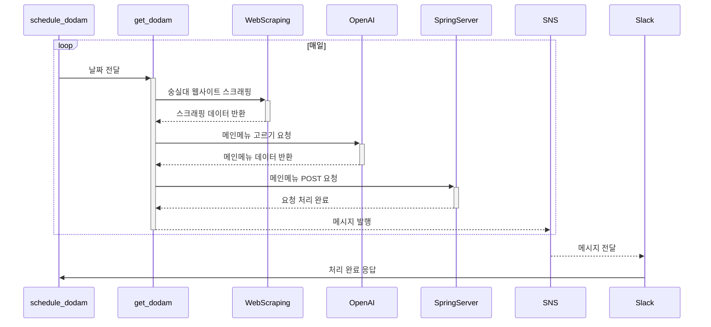

# food_scrapper_lambda

## Structure

```mermaid
sequenceDiagram
    participant schedule_dodam
    participant get_dodam
    participant WebScraping
    participant OpenAI
    participant SpringServer
    participant SNS
    participant Slack

    loop 매일
        schedule_dodam ->>+ get_dodam: 날짜 전달
        get_dodam ->>+ WebScraping: 숭실대 웹사이트 스크래핑
        WebScraping -->>- get_dodam: 스크래핑 데이터 반환
        get_dodam ->>+ OpenAI: 메인메뉴 고르기 요청
        OpenAI -->>- get_dodam: 메인메뉴 데이터 반환
        get_dodam ->>+ SpringServer: 메인메뉴 POST 요청
        SpringServer -->>- get_dodam: 요청 처리 완료
        get_dodam -->>- SNS: 메시지 발행
    end

    SNS -->> Slack: 메시지 전달
    Slack ->> schedule_dodam: 처리 완료 응답
```
